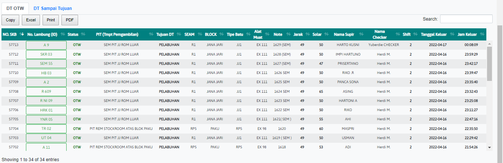

# DT OTW

### DT OTW

DT OTW adalah tabel yang menginformasikan keberangkatan truk pengiriman batubara. Jika terjadi kesalahan dalam pengiriman, klik No. Lambung untuk memperbaiki kesalahan dalam pengiriman

### RUBAH/EDIT SKB

.PNG>)

Form ini digunakan untuk mengubah ketika surat kirim batubara (SKB) jika mengalami kesalahan dalam pengiriman. Ini hanya bisa dirubah oleh operator yang mengirimkan SKB.
