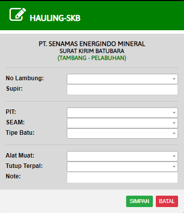

# SKB (Tambang-Pelabuhan)

### TAMBANG-PELABUHAN

Form ini digunakan untuk membuat surat kirim batubara (SKB) dari Tambang ke Pelabuhan. Saat ini ada 4 tipe kendaraan yang terdaftar untuk pengiriman batubara :

1. Subcont Leasing
2. Subcont Rental
3. Subcont Rental PS
4. DT R

* Nomer Lambung : Nomor lambung adalah nomor indentifikasi kendaraan yang mengirim batubara dari Tambang ke Pelabuhan. Semua nomor lambung harus didaftarkan terlebih dahulu sebelum melakukan pengiriman batubara. Jika nomor lambung tidak tersedia hubungi kordinator anda. Semua kendaraan yang terdaftar sudah diketahui jatah BBM untuk ke Pelabuhan, Tidak semua kendaraan mendapatkan jatah BBM
* SUPIR : Nama supir akan keluar secara otomatis ketika anda memasukan nama depan supir. Nama supir boleh apa saja untuk tipe kendaraan Subcont Leasing, Rental, dan Rental PS. Untuk DT R harus menggunakan nama supir yang tersedia, jika nama supir belum tersedia hubungin kordinator anda dan untuk sementara waktu nama supir boleh diketik manual dengan huruf kapital.
* PIT : PIT adalah tempat pengambilan batubara. Jika nama PIT belum tersedia, hubungi kordinator anda. Nama PIT berhubungan dengan pengupahan supir DT R dan pengupahan Subcont Leasing, Subcont Rental dan Subcont Rental PS. Masukanlah nama PIT dengan benar
* SEAM : Masukan informasi SEAM yang diberikan pihak tambang. Pilihan SEAM akan keluar otomatis jika kolom PIT sudah dimasukan. Jika nama SEAM belum tersedia, hubungi kordinator anda.
* Tipe Batu : Masukan jenis tipe batu yang diberikan pihak tambang. Pilihan Tipe batu akan keluar otomatis jika kolom SEAM sudah dimasukan. Jika jenis tipe batu tidak tersedia, hubungi kordinator anda.
* Alat Muat : Alat berat (Excavator) yang digunakan untuk memuat batubara ke DT (Dump Truck). Masukan nomer alat muat di berikan petugas tambang. jika nomer alat muat tidak tersedia, hubungi kordinator anda
* Tutup Terpal : Ketika dipos checker tambang setiap DT (Dump Truck) untuk pengiriman batubara diharuskan untuk melakukan penutupan terpal
* Note : Note ini digunakan ketika sistem aplikasi bermasalah/down. Supir akan di berikan secarik kertas (SKB manual), Ketika sistem aplikasi kembali normal kertas SKB manual yang telah diisi harus dimasukan ke sistem aplikasi untuk diproses. Masukanlah nomer yang ada di SKB manual ke NOTE
