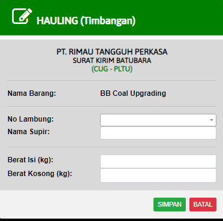

# Timbangan (CUG-PLTU)

### CUG-PLTU

Form ini digunakan untuk membuat surat kirim batubara (SKB) dari CUG ke PLTU. Saat ini ada 4 tipe kendaraan yang terdaftar untuk pengiriman batubara :

1. Subcont Leasing
2. Subcont Rental
3. Subcont Rental PS
4. DT R

* Nomer Lambung : Nomor lambung adalah nomor indentifikasi kendaraan yang mengirim batubara dari CUG KE PLTU. Semua nomor lambung harus didaftarkan terlebih dahulu sebelum melakukan pengiriman batubara. Jika nomor lambung tidak tersedia hubungi kordinator anda. Semua kendaraan yang terdaftar sudah diketahui jatah BBM untuk ke Pelabuhan, Tidak semua kendaraan mendapatkan jatah BBM
* SUPIR : Nama supir akan keluar secara otomatis ketika anda memasukan nama depan supir. Nama supir boleh apa saja untuk tipe kendaraan Subcont Leasing, Rental, dan Rental PS. Untuk DT R harus menggunakan nama supir yang tersedia, jika nama supir belum tersedia hubungin kordinator anda dan untuk sementara waktu nama supir boleh diketik manual dengan huruf kapital.
* Berat Isi(kg) : Masukan informasi berat isi/kotor kendaraan dengan memakai unit satuan kilogram (kg)
* Berat Kosong(kg) : Masukan informasi berat kosong/bersih kendaraan dengan memakai unit satuan kilogram (kg)
